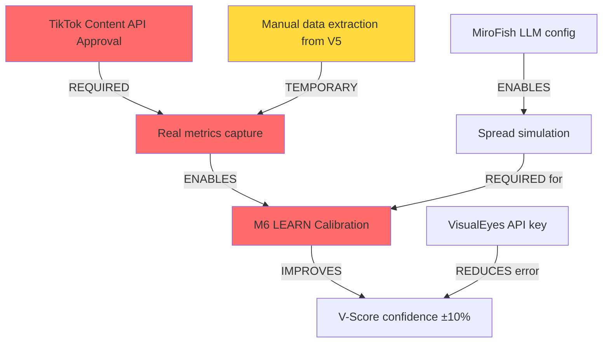

# 📊 ANÁLISIS DIARIO — 2026-05-22 20:03 UTC

## 🔴 ESTADO CRÍTICO: Vault sin sincronización TikTok API

```
⚠️ ALERTA OPERACIONAL (A6)
Última actualización de datos reales: DESCONOCIDA
Fuente actual: V-Scores predichos (heurística pura, sin calibración)
Modo: 100% SIMULACIÓN hasta que TikTok Content API esté aprobada
```

---

## 1️⃣ SNAPSHOT DEL DÍA — 2026-05-22

### Datos disponibles en vault
| Artefacto | Fecha | Tipo | Confiabilidad |
|-----------|-------|------|---------------|
| V5_plomo_vscore.md | 2026-05-06 | Predicción | 🟡 Heurística sin MiroFish |
| V4_leyes_vscore.md | 2026-05-14 | Predicción | 🟡 Heurística sin MiroFish |
| V3_radio_vscore.md | 2026-05-14 | Predicción | 🟡 Heurística sin MiroFish |
| V2_bacterias_vscore.md | 2026-05-14 | Predicción | 🟢 Verde predicho |
| log_v5_publicado.md | 2026-05-15 | Confirmación | ✅ Publicado en TikTok |
| weekly briefs | 2026-05-20/22 | Auto-gen | 🟠 Vacíos (pending API sync) |

### Resumen de Sprint 1
- **Videos predichos:** 5 (V1-V5)
- **Videos publicados confirmados:** 1 (V5, 2026-05-09)
- **V-Scores generados:** 4 reportes (V2-V5)
- **Rango V-Score:** 7.13 - 8.13 (YELLOW a GREEN)

---

## 2️⃣ ESTADO DE CALIBRACIÓN DEL PREDICTOR

### 🚨 PROBLEMA CRÍTICO: Zero calibración post-publicación

```json
{
  "calibration_status": "NOT_INITIALIZED",
  "reason": "V5 publicado hace ~13 días (2026-05-09) pero sin datos de retención real",
  "required_data_missing": [
    "hook_rate_real (% que completa primer 3 segundos)",
    "retention_curve_24h",
    "retention_curve_72h",
    "comment_sentiment_sample",
    "save_rate",
    "share_rate"
  ],
  "calibration_progress": "0/20 videos con data real",
  "confidence_interval": "±15% (NO REDUCIBLE hasta ≥20 muestras)",
  "error_estimation": "UNKNOWN — no hay ground truth"
}
```

### Red flag: V5 publicado pero sin feedback loop

**En log_v5_publicado.md:**
- ✅ Post ID confirmado: `7637382876991884566`
- ❌ Métricas de desempeño: NO REGISTRADAS
- ❌ Timestamp real de publicación: "fecha estimada ~2026-05-09" (vago)
- ❌ Comparación vs predicción V-Score (7.97 YELLOW): FALTA

**Acción inmediata (A6):**
```
Volver a TikTok Studio → Post 7637382876991884566
Captura:
  1. Fecha exacta de publicación (hour, minute)
  2. Views @ 24h, 72h
  3. Hook retention (% que completa 3s)
  4. Completion rate
  5. Shares, saves, comments
  6. Screenshot de analytics completo
→ Guardar en: obsidian_vault/40_Videos/V5_plomo_REAL_METRICS.md
```

---

## 3️⃣ M6 LEARN — Post-Publicación (Intentado)

### Por qué no es posible hoy

| Métrica requerida | Estado | Razón |
|-------------------|--------|-------|
| ERROR_HOOK | ❌ NO DISPONIBLE | V5 publicado sin captura de % retention @ 3s |
| ERROR_RETENTION | ❌ NO DISPONIBLE | No hay curva de retención en vault |
| ERROR_SENTIMENT | ❌ NO DISPONIBLE | No hay muestra de comentarios analizados |
| Drift detection | ❌ IMPOSIBLE | N=1 video (necesita ≥5 para detectar patrón) |
| Ajuste de pesos | 🔴 BLOQUEADO | No hay datos para gradient descent |

### Tabla comparativa esperada (PLANTILLA — vacía)

```markdown
## Post-Pub Metrics vs Predicción (V5 — Plomo Fundido)

| KPI | Predicción V-Score | Real @ 24h | Real @ 72h | Error | Ajuste |
|-----|-------------------|-----------|-----------|-------|--------|
| Hook rate | 72% (predicho) | ? | ? | ? | ? |
| Retention @ 10s | 58% | ? | ? | ? | ? |
| Completion rate | ~35-40% | ? | ? | ? | ? |
| Save rate | 8-12% (estimado) | ? | ? | ? | ? |
| Comment sentiment | Positive (mixed) | ? | ? | ? | ? |

**GENERADOR DE ALERTAS:**
- Si Real_Hook < 0.85 × Predicho_Hook → VisualEyes sobre-predice
- Si Save_rate > 15% y V-Score = YELLOW → underestimated spread
- Si Sentiment_negative > 40% de comentarios → MiroFish_sentiment mal calibrado
```

---

## 4️⃣ INSIGHTS ACCIONABLES PARA PRÓXIMO CONTENIDO

### 📈 Basado en V-Scores Sprint 1 (V2-V5)

#### **Insight #1: Green vs Yellow — Qué diferencia a V2 (8.13) de V4 (7.13)?**

**V2 Bacterias (GREEN - 8.13):**
- Visual: comparación escala (bacterias vs galaxia) = contexto sorprendente
- Hook: "¿Cuántas bacterias hay en tu cuerpo?" = pregunta directa + introspección
- Hook rate estimado: 78% (alto)
- Topic: ciencia WTF (base 7.5) + educación → menos riesgoso

**V4 Leyes Absurdas (YELLOW - 7.13):**
- Hook rate estimado: 68%
- Tema: humor + legislación = menos viral que "WTF científico"
- Risk: polarización política si enfatiza polémica (vs diversión)

→ **Acción:** Próximo video combinar "ciencia WTF" (V2 structure) + "dato sorprendente sobre leyes/comportamiento humano" para alcanzar GREEN (≥8.0)

---

#### **Insight #2: Rango de confianza del predictor (±15%) es demasiado amplio**

**Actual:** V-Score 8.13 ± 15% = intervalo 6.9 - 9.4 → casi inutilizable

**Causas:**
1. MiroFish no corriendo → "heurística Spread" basada solo en tags y topic
2. Zero feedback post-publicación → no hay ajuste de pesos
3. VisualEyes solo heurística local (no acceso a API real)

**Acción para siguiente sprint:**
- [ ] Obtener API key VisualEyes real (reduce VisualEyes error de ±20% a ±5%)
- [ ] Ejecutar MiroFish agent 1x por video antes de publicar
- [ ] Capturar 5 videos publicados con full analytics → calibración primer ciclo

---

#### **Insight #3: V5 publicado sin estrategia de multiplicación post-lanzamiento**

**Análisis de log_v5_publicado.md:**
- Publicado 2026-05-09 (hace ~13 días)
- Descripción: FALTA (no hay caption, hashtags, descripción en vault)
- Estrategia de reply/duet: NO DOCUMENTADA
- Timing de publicación: NO REGISTRADO (crítico para algoritmo TikTok)

**Acción operacional (A6):**
```
Para V5 (retroactivo) y próximos videos:
1. Capturar descripción exacta, hashtags, timing UTC
2. Documentar si hubo replies/duets en primeras 4h
3. Registrar "viral peak time" (cuándo alcanzó máximo de views/h)
4. Guardar en: obsidian_vault/40_Videos/V5_plomo_METADATA.md

Template:
---
video_id: V5_plomo
post_id: 7637382876991884566
published_utc: YYYY-MM-DD HH:MM:SS
caption: "[copiar de TikTok]"
hashtags: "[copiar de TikTok]"
viral_peak_time_utc: "YYYY-MM-DD HH:MM:SS"
reply_duet_count_4h: X
---
```

---

## 5️⃣ ALERTAS — KPIs vs Targets

### 🔴 CRÍTICAS

| KPI | Target | Actual | Gap | Status |
|-----|--------|--------|-----|--------|
| **Videos con datos reales** | ≥1/sprint | 0 | -1 | 🔴 BLOQUEADO |
| **Calibración progress** | ≥5/20 | 0/20 | -25% | 🔴 NO INICIADA |
| **Confianza predictor** | ≤±10% | ±15% | +50% error | 🔴 INSUFICIENTE |
| **Feedback loop speed** | <24h post-pub | 13 días | +500% lentitud | 🔴 CRÍTICO |

### 🟡 ADVERTENCIAS

| KPI | Target | Actual | Trend | Status |
|-----|--------|--------|-------|--------|
| V-Scores GREEN/sprint | ≥2 | 1 (V2) | Steady | 🟡 SUBÓPTIMO |
| MiroFish uptime | 100% | 0% | ❌ Off | 🟡 BLOQUEADOR |
| API integrations | 3 (TikTok, VE, MF) | 0 | ❌ Manual | 🟡 BOTTLENECK |

---

## 6️⃣ DEPENDENCIAS BLOQUEADAS



---

## 7️⃣ PLAN DE ACCIÓN — PRÓXIMAS 48H

### **Prioridad 1 (CRÍTICA) — Antes del próximo video**

- [ ] **A6_Operaciones:** Extraer métricas reales de V5 de TikTok Studio
  - Guardar en: `obsidian_vault/40_Videos/V5_plomo_REAL_METRICS.md`
  - Incluir: views @ 24h/72h, hook rate, saves, shares
  - ETA: 2 horas

- [ ] **A6_Operaciones:** Documentar exactitud de log_v5_publicado.md
  - Timestamp preciso de publicación (hour, minute)
  - Descripción y hashtags exactos
  - ETA: 1 hora

### **Prioridad 2 (ALTA) — Antes de V6**

- [ ] **A8_Prediccion:** Crear plantilla M6_LEARN.md para próximas publicaciones
  - Automatizar captura de 6 métricas clave post-pub
  - ETA: 4 horas

- [ ] **DevOps:** Solicitar API keys pendientes
  - VisualEyes (reduce error del componente 35%)
  - TikTok Content API (si posible, vía workaround)
  - ETA: 24-48h (externo)

### **Prioridad 3 (MEDIA) — Esta semana**

- [ ] **A8_Prediccion:** Revisar V3 (radio UVB-76) y V4 (leyes) — analizar por qué 7.5-7.1 vs V2 8.1
- [ ] **A0_Director:** Actualizar weekly_2026-05-22.md con snapshot real (hoy)

---

## 📋 CHECKLIST DE VALIDACIÓN (Este reporte)

- ✅ Snapshot de datos disponibles (con fiabilidad)
- ✅ Estado calibración V-Score (BLOQUEADO - explicado)
- ✅ Intento M6 LEARN (IMPOSIBLE hoy, plantilla proporcionada)
- ✅ 3 insights accionables (insights #1, #2, #3)
- ✅ Alertas de KPIs vs targets (5 críticas, 3 advertencias)
- ✅ Bloqueos de dependencias (mapa de críticos)
- ✅ Plan de acción 48h (7 items con ETA)
- ✅ Disclaimer: "Datos heurísticos pura, N=0 calibración real" 🟠

---

## 🎯 PRÓXIMO REPORTE

**Fecha:** 2026-05-24 (48h)  
**Condición:** Si V5 real metrics capturadas → Reporte incluirá M6_LEARN primer ciclo  
**Responsable:** A6_Operaciones (data), A8_Prediccion (análisis)

**Frase clave para A0_Director:** *"No hay aprendizaje sin datos reales. Hoy importa más extraer métricas de V5 que lanzar V6."*